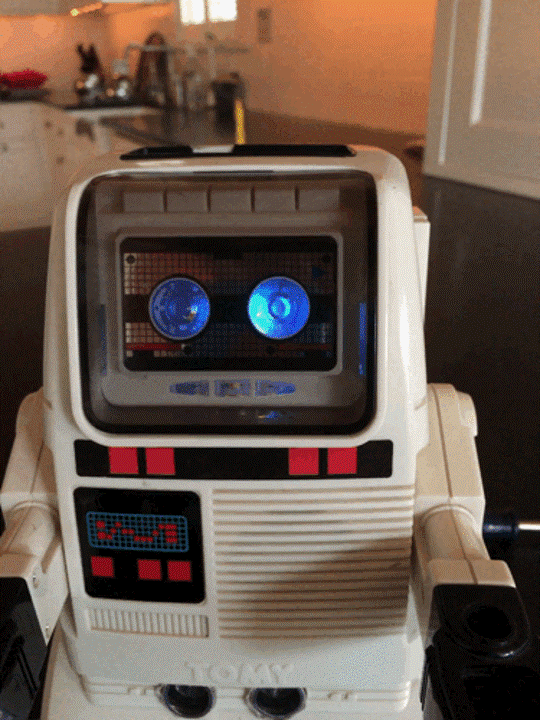
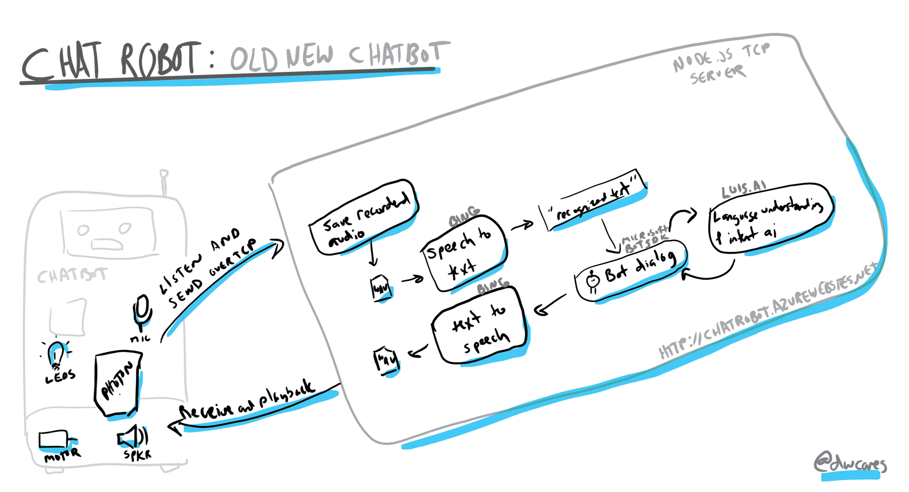
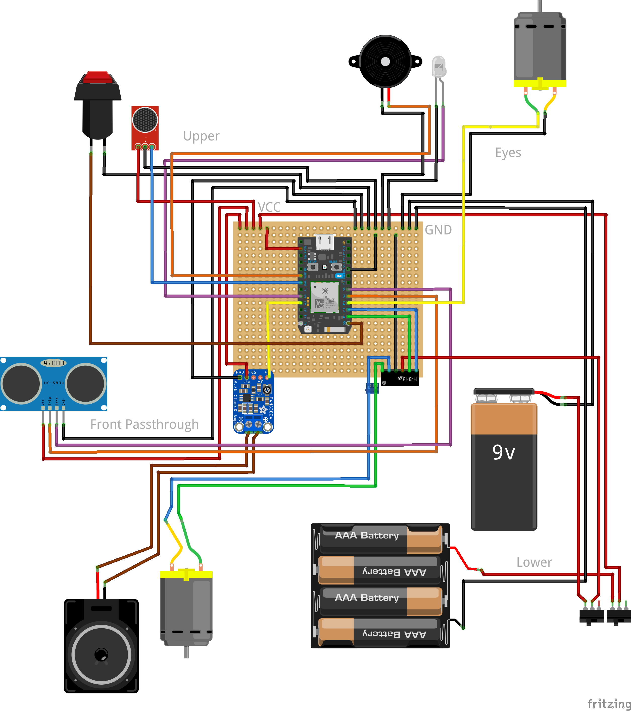
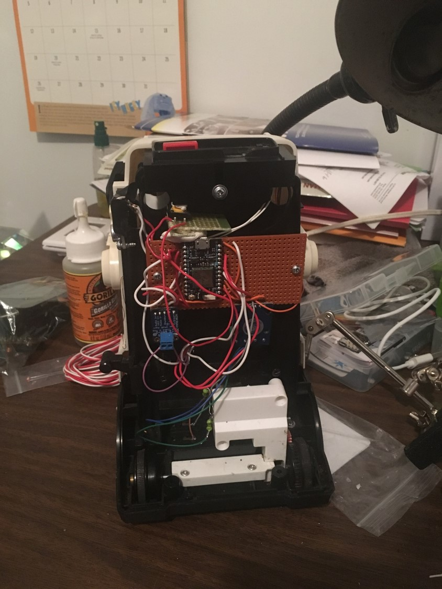

### ChatRobot

## VS Code
0. Enable Phone wifi
1. Join chatbot to phone wifi
2. Join PC to phone wifi
3. Start node server (full screen new desktop)
4. Open browser http://localhost:3000 (full screen, new desktop)
5. Open deck (full screen new desktop)
6. Swipe back to debug localhost

## Docker
docker run -p 3000:3000 -p 5000:5000 --env-file docker.env dwcares/chatrobot

0. (if changes) docker build .
1. start docker
2. connect to phone wifi 
3. check ip, update if needed
3. docker run -p 3000:3000 -p 8000:8000 --env-file docker.env 6cd5ca9ec364ae2f7a13e6e2b424f353d12b07c8fd45a06c4753f998886207af
4. turn on robot
5. open browser

